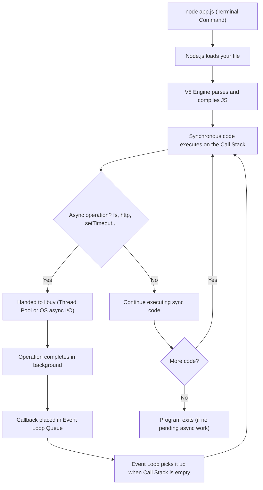

# Node.js — Complete Technical Reference

## Table of Contents

1. [What is Node.js?](#1-what-is-nodejs)
2. [Node.js Internal Architecture](#2-nodejs-internal-architecture)
3. [Component Deep Dive](#3-component-deep-dive)
   - [V8 Engine](#31-v8-engine)
   - [Node API (C++)](#32-node-api-c)
   - [libuv](#33-libuv)
   - [zlib](#34-zlib)
   - [js lib](#35-js-lib)
4. [Browser Runtime vs Node.js Runtime](#4-browser-runtime-vs-nodejs-runtime)
5. [How Node.js Executes JS Outside the Browser](#5-how-nodejs-executes-js-outside-the-browser)
6. [Node.js Formula](#6-nodejs-formula)
7. [Summary](#7-summary)
8. [Revision Checklist](#8-revision-checklist)

---

## 1. What is Node.js?

**Definition:**

> Node.js is a **runtime environment** that allows JavaScript to be executed **outside the browser** — directly on a machine (server, terminal, etc.).

Before Node.js, JavaScript could only run inside a browser (Chrome, Firefox, etc.) because browsers provided the engine + environment to run it. Node.js changed this by bundling the V8 engine together with a set of C++ libraries and exposing them as a standalone runtime.

**In simple words:** Node.js is to servers what a browser is to web pages — it gives JS a place to live and run.

```
Without Node.js:  JS only runs inside browser
With Node.js:     JS runs anywhere (server, CLI, desktop, IoT devices)
```

**Real-world uses of Node.js:**

- Building backend REST APIs (Express.js, Fastify)
- Running build tools (webpack, Vite, ESLint)
- Writing CLI tools (npm itself is built on Node)
- Real-time applications (chat apps, live dashboards via WebSockets)

---

## 2. Node.js Internal Architecture

Node.js is **not just JavaScript** — it is a collection of components written mostly in **C++**, assembled together to create a complete runtime environment.

```
┌──────────────────────────────────────────────────────────┐
│                        Node.js                           │
│                   Runtime Environment                    │
│                                                          │
│   ┌─────────────────┐    ┌──────────────────────────┐    │
│   │   JS Engine     │    │     Node API  (C++)      │    │
│   │   V8  (C++)     │    │  (fs, http, path, os...) │    │
│   └─────────────────┘    └──────────────────────────┘    │
│                                                          │
│                ┌──────────┐  ┌───────┐  ┌────────┐       │
│                │  libuv   │  │ zlib  │  │ js lib │       │
│                │  (C++)   │  │(C++)  │  │        │       │
│                └──────────┘  └───────┘  └────────┘       │
│                                                          │
│                         C++                              │
└──────────────────────────────────────────────────────────┘
```

---

## 3. Component Deep Dive

### 3.1 V8 Engine

**What it is:** The same JavaScript engine used in **Google Chrome**, written in **C++** by Google.

**What it does:**

- Parses and compiles your JavaScript code into machine code
- Manages memory (heap allocation, garbage collection)
- Executes the compiled machine code on the CPU

**Key point:** V8 alone only understands JavaScript. It has no knowledge of files, networks, or the operating system. That's where the other Node components come in.

```
Your JS code  →  V8 parses it  →  V8 compiles to machine code  →  CPU runs it
```

---

### 3.2 Node API (C++)

**What it is:** A set of **built-in modules and bindings written in C++** that expose system-level functionality to JavaScript code.

**What it does:**

- Bridges the gap between JavaScript and the operating system
- Wraps low-level C++ system calls in JavaScript-friendly APIs

**Examples of Node APIs exposed to JS:**

| Node Module     | What it does                          |
| --------------- | ------------------------------------- |
| `fs`            | Read/write files on disk              |
| `http`          | Create HTTP servers and make requests |
| `path`          | Work with file system paths           |
| `os`            | Get OS info (CPU, memory, platform)   |
| `crypto`        | Hashing, encryption, random bytes     |
| `stream`        | Work with streaming data              |
| `events`        | EventEmitter — custom event handling  |
| `child_process` | Spawn subprocesses                    |

```javascript
// Using Node API — fs module (only works in Node, not in browser)
const fs = require("fs");

fs.readFile("./notes.txt", "utf8", (err, data) => {
  if (err) throw err;
  console.log(data);
});
```

> **Why C++?** Because file I/O, networking, and OS interactions require direct system calls that JavaScript cannot make on its own. C++ bridges that gap.

---

### 3.3 libuv

**What it is:** An open-source **C++ library** originally written for Node.js, now used by other runtimes too.

**What it does — the most important component after V8:**

- Implements the **Event Loop** in Node.js
- Handles all **asynchronous I/O operations**:
  - File system operations (reading/writing files)
  - Network I/O (TCP/UDP sockets)
  - DNS resolution
  - Timers (`setTimeout`, `setInterval`)
  - Child processes
- Manages a **Thread Pool** for operations that cannot be done asynchronously at the OS level

**libuv Thread Pool:**

While Node.js is single-threaded for JavaScript execution, libuv maintains a pool of **4 worker threads** (by default) to handle heavy I/O tasks that would otherwise block the main thread.

```
Main Thread (JS + Event Loop)
     │
     ├──► libuv Thread Pool (4 threads by default)
     │         │
     │         ├── Thread 1: file system read
     │         ├── Thread 2: DNS lookup
     │         ├── Thread 3: crypto operation
     │         └── Thread 4: available
     │
     └──► Result returned to Event Loop → callback fires
```

```javascript
// This uses libuv's thread pool under the hood
const fs = require("fs");

fs.readFile("bigfile.txt", (err, data) => {
  // This callback fires after libuv completes the file read
  // in a background thread — JS main thread was never blocked
  console.log("File read complete");
});

console.log("This prints BEFORE file read completes"); // non-blocking
```

---

### 3.4 zlib

**What it is:** A **C++ compression library** bundled with Node.js.

**What it does:**

- Provides data **compression and decompression**
- Supports formats: `gzip`, `deflate`, `brotli`
- Used heavily in HTTP servers to compress responses before sending them to clients (reduces bandwidth)

```javascript
// Using zlib in Node.js
const zlib = require("zlib");
const fs = require("fs");

// Compress a file using gzip
fs.createReadStream("input.txt")
  .pipe(zlib.createGzip())
  .pipe(fs.createWriteStream("input.txt.gz"));

console.log("File compressed successfully");
```

**Real-world use:** When you visit a website and the server returns a response with `Content-Encoding: gzip`, Node.js is using zlib to compress the response body, reducing its size by up to 70-80%.

---

### 3.5 js lib

**What it is:** The **JavaScript standard library** bundled with Node.js — the core JS modules written in JavaScript itself (not C++).

**What it does:**

- Provides pure-JS utilities that wrap or complement the C++ bindings
- Examples include parts of the `util`, `events`, `buffer`, and `stream` modules

**Think of it as:** The JavaScript "glue code" that sits on top of the C++ layer and makes the APIs feel natural to use from your JS code.

---

## 4. Browser Runtime vs Node.js Runtime

Both are runtime environments for JavaScript, but they serve different purposes and provide different APIs.

| Feature                 | Browser Runtime                            | Node.js Runtime                 |
| ----------------------- | ------------------------------------------ | ------------------------------- |
| **Purpose**             | Run JS for web pages / UI                  | Run JS on a server / machine    |
| **JS Engine**           | V8 (Chrome), SpiderMonkey (Firefox)        | V8 (always)                     |
| **APIs provided**       | Web APIs: DOM, fetch, localStorage, window | Node APIs: fs, http, os, crypto |
| **Event Loop**          | Browser-managed                            | libuv-managed                   |
| **Has DOM?**            | ✅ Yes                                     | ❌ No                           |
| **Has `window`?**       | ✅ Yes                                     | ❌ No (has `global` instead)    |
| **Can read files?**     | ❌ No (security restriction)               | ✅ Yes (via `fs` module)        |
| **Can create servers?** | ❌ No                                      | ✅ Yes (via `http` module)      |
| **Global object**       | `window`                                   | `global`                        |

```javascript
// This works in BROWSER only:
document.getElementById("title").textContent = "Hello";
localStorage.setItem("key", "value");
window.alert("Hi!");

// This works in NODE only:
const fs = require("fs");
fs.writeFileSync("output.txt", "Hello World");

const http = require("http");
http.createServer((req, res) => res.end("Hello")).listen(3000);
```

---

## 5. How Node.js Executes JS Outside the Browser

When you run `node app.js` in your terminal, here is the complete flow:

### Step-by-Step Execution Flow



**Key difference from browser:** In a browser, the runtime lives as long as the tab is open. In Node.js, the process exits automatically when the Call Stack is empty AND there are no pending async operations (no timers, no open servers, no pending I/O).

```javascript
// Node.js process stays alive because of the HTTP server (open async handle)
const http = require("http");

const server = http.createServer((req, res) => {
  res.end("Hello from Node.js server!");
});

server.listen(3000, () => {
  console.log("Server running on port 3000");
});
// Process does NOT exit — it waits for incoming requests indefinitely
```

---

## 6. Node.js Formula

From the diagram notes:

```
JS Engine (C++) + Node API (C++) + libuv + zlib + js lib + ... = Node.js
```

This formula shows that Node.js is an **assembled runtime** — it takes the V8 engine (which only understands JS) and wraps it with a full suite of C++ libraries to give JavaScript the ability to interact with the operating system, file system, network, and more.

**Analogy:** V8 is the engine of a car. Node.js is the entire car — with steering, wheels, fuel system, and dashboard. The engine alone doesn't take you anywhere; you need the full assembly.

---

## 7. Summary

| Concept                    | Key Point                                                       |
| -------------------------- | --------------------------------------------------------------- |
| **Node.js definition**     | A runtime environment that executes JS code outside the browser |
| **Core engine**            | V8 (C++) — same engine as Google Chrome                         |
| **System access**          | Node API (C++) — exposes fs, http, os, crypto, etc.             |
| **Async I/O & Event Loop** | libuv (C++) — thread pool, timers, network I/O                  |
| **Compression**            | zlib (C++) — gzip/deflate/brotli                                |
| **JS utilities**           | js lib — standard JS library modules                            |
| **Written in**             | Mostly C++, with JS bindings on top                             |
| **Key advantage**          | JS can now run on servers, build tools, CLI — not just browsers |

---

## 8. Revision Checklist

- [ ] Can you define Node.js in one sentence?
- [ ] Can you explain why Node.js was needed (what problem it solved)?
- [ ] Can you name all 5 major internal components of Node.js?
- [ ] Can you explain what V8 does and what it **cannot** do alone?
- [ ] Can you explain what Node API (C++) provides and give 3 examples (`fs`, `http`, `os`)?
- [ ] Can you explain what libuv does and why it is critical for async Node.js?
- [ ] Can you explain what the libuv thread pool is and why it exists?
- [ ] Can you explain what zlib is used for in a real server?
- [ ] Can you compare Browser runtime vs Node.js runtime (DOM, window, file access)?
- [ ] Can you explain when a Node.js process exits automatically?
- [ ] Can you write a basic Node.js HTTP server from memory?
- [ ] Can you read a file asynchronously using `fs.readFile` with a callback?

---

> **Interview tip:** When asked "What is Node.js?", never just say "it runs JavaScript on the server." Say: _"Node.js is a runtime environment built on top of Google's V8 engine, combined with libuv for async I/O, and a set of C++ bindings (Node API) that expose OS-level capabilities to JavaScript — allowing JS to run outside the browser."_ That answer stands out.
