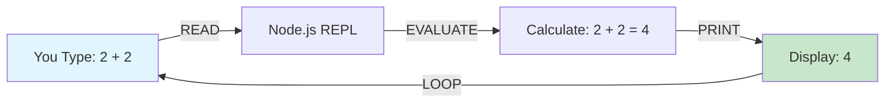
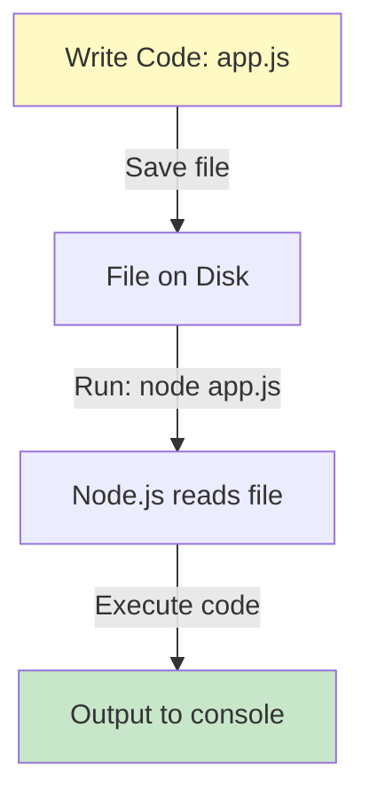
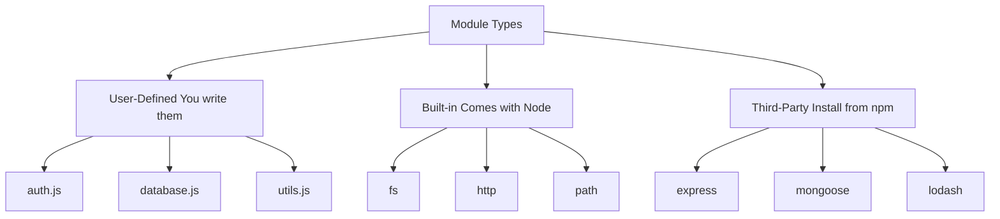

# Node.js — REPL, Execution, Global Objects & Module Systems

### Complete Deep Dive — Everything Explained in Great Detail

---

## 📚 What You'll Learn

This guide covers **fundamental Node.js concepts** from the ground up:

✅ REPL — what it is, how to use it, when to use it  
✅ Executing JavaScript files with Node  
✅ Global objects — `global` vs `window`  
✅ What modules are and why they're essential  
✅ CommonJS vs ES Modules — complete comparison  
✅ All 3 types of modules with detailed examples  
✅ Import/export patterns for both systems

**Best for:** Node.js beginners, understanding fundamentals, interview preparation

---

## Table of Contents

1. [REPL — Read, Evaluate, Print, Loop](#1-repl--read-evaluate-print-loop)
2. [Executing JavaScript Files with Node](#2-executing-javascript-files-with-node)
3. [Global Objects — global vs window](#3-global-objects--global-vs-window)
4. [What Are Modules?](#4-what-are-modules)
5. [Why Do We Need Modules?](#5-why-do-we-need-modules)
6. [The Two Module Systems](#6-the-two-module-systems)
7. [CommonJS — The Default System](#7-commonjs--the-default-system)
8. [ES Modules — The Modern System](#8-es-modules--the-modern-system)
9. [The Three Types of Modules](#9-the-three-types-of-modules)
10. [User-Defined Modules — Complete Guide](#10-user-defined-modules--complete-guide)
11. [Built-in Modules — Complete Guide](#11-built-in-modules--complete-guide)
12. [Third-Party Modules — Complete Guide](#12-third-party-modules--complete-guide)
13. [Complete Comparison Tables](#13-complete-comparison-tables)
14. [Summary](#14-summary)
15. [Revision Checklist](#15-revision-checklist)

---

## 1. REPL — Read, Evaluate, Print, Loop

### What Is REPL?

**REPL stands for Read-Evaluate-Print-Loop.** It's an **interactive shell** — a command-line interface where you can type JavaScript code and see results immediately, line by line.

Think of it like:

- A **calculator** — you type an expression, it shows the result instantly
- A **playground** — test ideas without creating files
- A **quick tester** — check if your code works before putting it in a file

---

### What Each Letter Means

```
R = READ      → Reads your input (the code you type)
E = EVALUATE  → Executes/runs that code
P = PRINT     → Displays the result
L = LOOP      → Goes back and waits for the next input
```

**Visual Flow:**

```
Type code → Node READS it → Node EVALUATES it → Node PRINTS result → LOOP back (repeat)
```

---

### How to Enter REPL

**Step 1:** Open your terminal/command prompt

**Step 2:** Type `node` and press Enter

```bash
$ node

# You'll see:
Welcome to Node.js v20.0.0
Type ".help" for more information.
>
```

The `>` symbol means you're in REPL mode — ready to type JavaScript!

---

### Using REPL — Examples

```javascript
// Example 1: Simple math
> 2 + 2
4

// Example 2: Variables
> let name = "John"
undefined
> name
'John'

// Example 3: Functions
> function greet(name) { return "Hello " + name; }
undefined
> greet("Alice")
'Hello Alice'

// Example 4: Arrays
> let nums = [1, 2, 3, 4]
undefined
> nums.map(x => x * 2)
[ 2, 4, 6, 8 ]

// Example 5: Check Node version
> process.version
'v20.0.0'
```

**Notice:** Every expression returns a result immediately!

---

### How to Exit REPL

**Three ways to exit:**

```bash
# Method 1: Press Ctrl + C (twice)
> ^C
> ^C
(To exit, press Ctrl+C again or type .exit)

# Method 2: Type .exit
> .exit
$

# Method 3: Press Ctrl + D (once)
> ^D
$
```

The `$` symbol means you're back in your regular terminal.

---

### REPL Special Commands

When you're in REPL, you can use special commands that start with `.`:

```javascript
> .help        // Show all available commands
> .clear       // Clear the REPL context (reset all variables)
> .exit        // Exit REPL
> .save file.js  // Save current session to a file
> .load file.js  // Load and execute a file
> .editor      // Enter editor mode (multi-line)
```

---

### When to Use REPL

| Use Case              | Why REPL Works                                   |
| --------------------- | ------------------------------------------------ |
| **Quick calculation** | `> 15 * 8 + 32` → instant result                 |
| **Test a function**   | Write a small function, test it immediately      |
| **Check syntax**      | "Does this work?" → try it in REPL               |
| **Explore APIs**      | `> Math.` then press Tab to see all Math methods |
| **Learning**          | Experiment with new concepts interactively       |
| **Debugging**         | Test a specific piece of logic in isolation      |

---

### When NOT to Use REPL

| Use Case               | Why NOT REPL                               |
| ---------------------- | ------------------------------------------ |
| **Building an app**    | Need organized files, not interactive mode |
| **Long code**          | REPL is tedious for more than 10 lines     |
| **Saving work**        | REPL session is lost when you exit         |
| **Running servers**    | Servers need to stay running (use files)   |
| **Team collaboration** | Can't share a REPL session easily          |

---

### Visual: REPL Workflow



---

## 2. Executing JavaScript Files with Node

### The Problem with REPL

REPL is great for quick tests, but you can't:

- Save your work for later
- Write long programs
- Share code with others
- Run the same code repeatedly

**Solution:** Write code in a `.js` file and execute it with Node!

---

### Creating and Running a JavaScript File

**Step 1: Create a file** (e.g., `app.js`)

```javascript
// app.js
console.log("Hello from Node.js!");

function add(a, b) {
  return a + b;
}

let result = add(5, 3);
console.log("5 + 3 =", result);
```

**Step 2: Open terminal in the correct directory**

```bash
# Navigate to where your file is
$ cd /path/to/your/project
```

> ⚠️ **CRITICAL:** The terminal must be in the same directory as your file, or you must provide the correct path!

**Step 3: Execute the file**

```bash
$ node app.js

# Output:
Hello from Node.js!
5 + 3 = 8
```

---

### File Extension Is Optional

```bash
# Both work the same:
$ node app.js     ✅
$ node app        ✅

# Node automatically looks for .js files
```

---

### Common Errors and Solutions

#### Error 1: File Not Found

```bash
$ node app.js
Error: Cannot find module '/Users/you/app.js'
```

**Cause:** Terminal is in the wrong directory  
**Solution:** Use `cd` to navigate to the correct folder

```bash
$ cd /Users/you/project    # Navigate to correct folder
$ node app.js              # Now it works
```

---

#### Error 2: Wrong Path

```bash
$ node myapp.js
Error: Cannot find module
```

**Cause:** Typo in filename or file doesn't exist  
**Solution:** Double-check the filename exactly (case-sensitive!)

```bash
$ ls                  # List files in current directory
app.js  index.js      # These are the files you have

$ node app.js         # Use the exact name
```

---

### Executing Files in Different Locations

**Current directory:**

```bash
$ node app.js
```

**Subdirectory:**

```bash
$ node src/app.js
$ node utils/helper.js
```

**Parent directory:**

```bash
$ node ../app.js
```

**Absolute path:**

```bash
$ node /Users/yourname/projects/myapp/app.js
```

---

### Visual: File Execution Flow



---

## 3. Global Objects — global vs window

### What Are Global Objects?

**A global object is a built-in object** that contains properties and methods available **everywhere** in your code — you don't need to import or declare anything.

Think of it like:

- **Public utilities** in a city — available to everyone
- **Standard library** — always loaded automatically

---

### Browser vs Node.js — Different Global Objects

```
Browser:    window   (the global object)
Node.js:    global   (the global object)
```

**Why different names?**

- Browsers have a **window** (the browser window/tab)
- Node.js runs on a **server** (no window — no visual display)

---

### window — The Browser Global Object

```javascript
// In a browser (Chrome, Firefox, etc.):

console.log(window); // Shows the global object
// Output: Window { ... }

// Everything attached to window:
window.console.log("Hello"); // console is part of window
window.setTimeout(() => {}, 1000); // setTimeout is part of window
window.location.href; // URL of current page
window.document; // The HTML document
```

**In browsers, you can omit `window.` because it's the default:**

```javascript
// These are equivalent in a browser:
console.log("Hello");
window.console.log("Hello");

// Both work because console is on window
```

---

### global — The Node.js Global Object

```javascript
// In Node.js:

console.log(global); // Shows the global object
// Output: <ref *1> Object [global] { ... }

// Everything attached to global:
global.console.log("Hello"); // console is part of global
global.setTimeout(() => {}, 1000); // setTimeout is part of global
global.process; // Process object (Node-specific)
global.Buffer; // Buffer class (Node-specific)
```

**In Node.js, you can omit `global.` as well:**

```javascript
// These are equivalent in Node.js:
console.log("Hello");
global.console.log("Hello");

// Both work because console is on global
```

---

### What Happens If You Try to Use window in Node.js?

```javascript
// In Node.js:
console.log(window);

// Output:
ReferenceError: window is not defined
```

**Why?** Because Node.js doesn't have a browser window! It runs on a server.

---

### What Happens If You Try to Use global in a Browser?

```javascript
// In a browser:
console.log(global);

// Output:
ReferenceError: global is not defined
```

**Why?** Because browsers use `window`, not `global`.

---

### globalThis — The Universal Solution

**Problem:** Code that works in both browser AND Node.js

**Solution:** Use `globalThis` — it works everywhere!

```javascript
// Works in BOTH browser and Node.js:
console.log(globalThis);

// In browser: points to window
// In Node.js: points to global
```

**Use case:** Writing code that runs in multiple environments

```javascript
// Universal code:
function getGlobalObject() {
  return globalThis;
}

// Works in browser AND Node.js
```

---

### Common Properties on Global Objects

| Property        | Browser (window) | Node.js (global) | Purpose                      |
| --------------- | ---------------- | ---------------- | ---------------------------- |
| `console`       | ✅               | ✅               | Logging to console           |
| `setTimeout`    | ✅               | ✅               | Delayed execution            |
| `setInterval`   | ✅               | ✅               | Repeated execution           |
| `clearTimeout`  | ✅               | ✅               | Cancel timeout               |
| `clearInterval` | ✅               | ✅               | Cancel interval              |
| `document`      | ✅               | ❌               | HTML document (browser only) |
| `window`        | ✅               | ❌               | Browser window               |
| `process`       | ❌               | ✅               | Node process info            |
| `Buffer`        | ❌               | ✅               | Binary data handling         |
| `require`       | ❌               | ✅               | Import modules (CommonJS)    |

---

### Visual Comparison

```
┌─────────────────────────────────────────────────────────┐
│                      BROWSER                            │
│                                                         │
│  window (global object)                                 │
│  ├── console                                           │
│  ├── setTimeout                                        │
│  ├── document  ← HTML page                            │
│  ├── location  ← URL                                  │
│  └── navigator ← Browser info                         │
└─────────────────────────────────────────────────────────┘

┌─────────────────────────────────────────────────────────┐
│                      NODE.JS                            │
│                                                         │
│  global (global object)                                 │
│  ├── console                                           │
│  ├── setTimeout                                        │
│  ├── process   ← Node process                         │
│  ├── Buffer    ← Binary data                          │
│  └── require   ← Import modules                       │
└─────────────────────────────────────────────────────────┘
```

---

## 4. What Are Modules?

### Simple Definition

**A module is a logical piece of code** that:

1. Performs a specific function or task
2. Can be **reused** in multiple places
3. Is contained in its own file (usually)

Think of modules like:

- **LEGO bricks** — small, reusable pieces that build something bigger
- **Tools in a toolbox** — each tool has a specific purpose
- **Ingredients in cooking** — you can reuse salt in many recipes

---

### The Problem Without Modules

**Imagine writing all your code in ONE giant file:**

```javascript
// ❌ BAD — Everything in one file (10,000 lines!)

// User authentication code (500 lines)
function login(username, password) { ... }
function logout() { ... }
function checkAuth() { ... }

// Database code (800 lines)
function connectDB() { ... }
function query() { ... }
function disconnect() { ... }

// Email code (600 lines)
function sendEmail() { ... }
function validateEmail() { ... }

// Payment code (900 lines)
function processPayment() { ... }
function refund() { ... }

// ... 7,200 more lines ...
```

**Problems:**

1. **Hard to read** — scrolling through 10,000 lines
2. **Hard to maintain** — fixing one thing might break another
3. **Hard to test** — can't test individual pieces
4. **Hard to collaborate** — everyone editing the same file causes conflicts
5. **Hard to reuse** — can't easily use the email code in another project

---

### The Solution With Modules

**Break code into separate files (modules):**

```
project/
├── auth.js        ← Authentication module (500 lines)
├── database.js    ← Database module (800 lines)
├── email.js       ← Email module (600 lines)
├── payment.js     ← Payment module (900 lines)
└── app.js         ← Main file (uses all modules, 100 lines)
```

**Now each file has ONE clear purpose!**

---

### Real-World Analogy

**Building a House Without Modules:**

```
❌ Build everything on-site from scratch:
   - Make bricks
   - Mix cement
   - Cut wood
   - Create nails
   - Smelt metal for pipes
   → Takes 5 years!
```

**Building a House With Modules:**

```
✅ Use pre-made components (modules):
   - Buy bricks (brick module)
   - Buy cement (cement module)
   - Buy pre-cut wood (wood module)
   - Buy pipes (plumbing module)
   → Takes 6 months!
```

---

### Code Example: Without vs With Modules

**❌ Without modules (one big file):**

```javascript
// Everything in app.js

function add(a, b) { return a + b; }
function subtract(a, b) { return a - b; }
function multiply(a, b) { return a * b; }
function divide(a, b) { return a / b; }
function greet(name) { return "Hello " + name; }
function farewell(name) { return "Goodbye " + name; }
function sendEmail(to, subject, body) { ... }
function validateEmail(email) { ... }
// ... 100 more functions ...

// Using the functions:
console.log(add(2, 3));
console.log(greet("John"));
```

**✅ With modules (organized):**

```javascript
// math.js (module)
function add(a, b) { return a + b; }
function subtract(a, b) { return a - b; }
module.exports = { add, subtract };

// greetings.js (module)
function greet(name) { return "Hello " + name; }
function farewell(name) { return "Goodbye " + name; }
module.exports = { greet, farewell };

// email.js (module)
function sendEmail(to, subject, body) { ... }
function validateEmail(email) { ... }
module.exports = { sendEmail, validateEmail };

// app.js (uses modules)
const math = require('./math');
const greetings = require('./greetings');

console.log(math.add(2, 3));
console.log(greetings.greet("John"));
```

**Benefits:**

- Each file has ONE responsibility
- Easy to find things
- Easy to test each module separately
- Easy to reuse modules in other projects

---

## 5. Why Do We Need Modules?

### The 6 Key Benefits

```
1. Reusability     → Write once, use many times
2. Maintainability → Easy to update/fix
3. Readability     → Small files are easier to understand
4. Scalability     → Easy to add new features
5. Encapsulation   → Hide internal details
6. Collaboration   → Multiple people can work on different modules
```

---

### 1. Reusability (DRY Principle)

**DRY = Don't Repeat Yourself**

```javascript
// ❌ WITHOUT modules — repeating code
// file1.js
function formatDate(date) {
  return date.toLocaleDateString();
}

// file2.js
function formatDate(date) {
  return date.toLocaleDateString(); // Same code again!
}

// file3.js
function formatDate(date) {
  return date.toLocaleDateString(); // Again!
}
```

```javascript
// ✅ WITH modules — write once, use everywhere
// dateUtils.js (module)
function formatDate(date) {
  return date.toLocaleDateString();
}
module.exports = { formatDate };

// file1.js
const { formatDate } = require("./dateUtils");
formatDate(new Date());

// file2.js
const { formatDate } = require("./dateUtils");
formatDate(new Date());

// file3.js
const { formatDate } = require("./dateUtils");
formatDate(new Date());
```

**If you need to change formatDate, you only change ONE file!**

---

### 2. Maintainability (Easy Updates)

```javascript
// ❌ WITHOUT modules — hard to update
// One big file with 1000 email-related functions
// If you need to change one thing, you search through 1000 functions

// ✅ WITH modules — easy to update
// email.js (50 functions, all email-related)
// If you need to change email logic, you know exactly where to look!
```

---

### 3. Readability (Small Files)

**Which is easier to understand?**

```
File A: 5,000 lines (no modules)
File B: 10 files × 50 lines each (with modules)

Answer: File B! Smaller files are easier to read and understand.
```

---

### 4. Scalability (Easy to Grow)

```
Week 1:  auth.js
Week 2:  auth.js, database.js
Week 3:  auth.js, database.js, email.js
Week 4:  auth.js, database.js, email.js, payment.js

Easy to add new modules without breaking existing code!
```

---

### 5. Encapsulation (Hide Details)

```javascript
// email.js (module)
function sendEmail(to, message) {
  // Internal implementation
  let connection = createSMTPConnection(); // Hidden detail
  let formatted = formatMessage(message); // Hidden detail
  connection.send(to, formatted); // Hidden detail
}

// Only expose what's needed
module.exports = { sendEmail }; // Everything else is hidden

// app.js
const { sendEmail } = require("./email");
sendEmail("user@example.com", "Hello!");
// We don't need to know HOW it sends — just that it works!
```

---

### 6. Collaboration (Team Work)

```
Team member 1: Works on auth.js
Team member 2: Works on database.js
Team member 3: Works on email.js

No conflicts! Everyone works on their own module.
```

---

## 6. The Two Module Systems

### Why Two Systems?

**Historical reason:**

1. **CommonJS** (2009) — Created for Node.js specifically
2. **ES Modules** (2015) — Created as JavaScript standard (works in browsers too)

Node.js originally used CommonJS. Later, ES Modules became the standard, so Node.js added support for both!

---

### Quick Overview

| Feature             | CommonJS          | ES Modules                  |
| ------------------- | ----------------- | --------------------------- |
| **When created**    | 2009 (older)      | 2015 (newer)                |
| **Used by**         | Node.js (default) | Browsers + Node.js          |
| **Export keyword**  | `module.exports`  | `export`                    |
| **Import keyword**  | `require()`       | `import`                    |
| **File extension**  | `.js`             | `.mjs` or `.js` with config |
| **Syntax**          | Dynamic           | Static                      |
| **Top-level await** | ❌ No             | ✅ Yes                      |

---

### Visual Comparison

```
CommonJS (Old but default in Node):
┌─────────────────────────────────┐
│ // math.js                      │
│ module.exports = { add }        │
└─────────────────────────────────┘
          ↓
┌─────────────────────────────────┐
│ // app.js                       │
│ const math = require('./math')  │
└─────────────────────────────────┘

ES Modules (New and standard):
┌─────────────────────────────────┐
│ // math.js                      │
│ export function add(a, b) {}    │
└─────────────────────────────────┘
          ↓
┌─────────────────────────────────┐
│ // app.js                       │
│ import { add } from './math.js' │
└─────────────────────────────────┘
```

---

## 7. CommonJS — The Default System

### What Is CommonJS?

**CommonJS is the module system** Node.js uses **by default**. It's been around since 2009 and is still widely used.

**Key features:**

- Export: `module.exports`
- Import: `require()`
- File extension in path: **optional**
- Syntax: Simpler, less strict

---

### Exporting in CommonJS

#### Single Export

```javascript
// greet.js
function greet(name) {
  return "Hello " + name;
}

// Export ONE thing
module.exports = greet;
```

```javascript
// app.js
const greet = require("./greet");

console.log(greet("Alice")); // "Hello Alice"
```

---

#### Multiple Exports

```javascript
// math.js
function add(a, b) {
  return a + b;
}
function subtract(a, b) {
  return a - b;
}
function multiply(a, b) {
  return a * b;
}

// Export MULTIPLE things (as object)
module.exports = {
  add,
  subtract,
  multiply,
};
```

```javascript
// app.js
const math = require("./math");

console.log(math.add(2, 3)); // 5
console.log(math.subtract(5, 2)); // 3
console.log(math.multiply(2, 4)); // 8
```

---

#### Destructuring Imports

```javascript
// Import only what you need
const { add, multiply } = require("./math");

console.log(add(2, 3)); // 5
console.log(multiply(2, 4)); // 8
// subtract is not imported
```

---

### File Extension Is Optional

```javascript
// All of these work the same:
const math = require('./math.js');   ✅
const math = require('./math');      ✅
const math = require('./math.cjs');  ✅ (.cjs = explicit CommonJS)

// Node automatically looks for .js files
```

---

### Complete CommonJS Example

**Project structure:**

```
project/
├── utils.js
├── database.js
└── app.js
```

**utils.js (module):**

```javascript
function capitalize(str) {
  return str.charAt(0).toUpperCase() + str.slice(1);
}

function lowercase(str) {
  return str.toLowerCase();
}

module.exports = { capitalize, lowercase };
```

**database.js (module):**

```javascript
function connect() {
  console.log("Database connected");
}

function disconnect() {
  console.log("Database disconnected");
}

module.exports = { connect, disconnect };
```

**app.js (main file):**

```javascript
const utils = require("./utils");
const db = require("./database");

// Use utils
console.log(utils.capitalize("hello")); // "Hello"

// Use database
db.connect(); // "Database connected"
db.disconnect(); // "Database disconnected"
```

---

## 8. ES Modules — The Modern System

### What Are ES Modules?

**ES Modules (ESM)** is the **modern, standardized** module system introduced in ES6 (2015). It works in **both browsers and Node.js**.

**Key features:**

- Export: `export` keyword
- Import: `import` keyword
- File extension in path: **required**
- Syntax: More strict, more features

---

### Enabling ES Modules in Node.js

**Method 1: Use .mjs extension**

```javascript
// math.mjs (the .mjs tells Node this is ESM)
export function add(a, b) {
  return a + b;
}
```

**Method 2: Add "type": "module" to package.json**

```json
{
  "type": "module"
}
```

Now ALL `.js` files use ES Modules!

---

### Named Exports

```javascript
// math.js
export function add(a, b) {
  return a + b;
}

export function subtract(a, b) {
  return a - b;
}

export const PI = 3.14159;
```

```javascript
// app.js
import { add, subtract, PI } from "./math.js";

console.log(add(2, 3)); // 5
console.log(subtract(5, 2)); // 3
console.log(PI); // 3.14159
```

---

### Default Export

```javascript
// greet.js
function greet(name) {
  return "Hello " + name;
}

export default greet; // Default export
```

```javascript
// app.js
import greet from "./greet.js"; // No curly braces!

console.log(greet("Alice")); // "Hello Alice"
```

---

### Combining Default + Named Exports

```javascript
// utils.js
export function helper1() { ... }
export function helper2() { ... }

function mainFunction() { ... }
export default mainFunction;
```

```javascript
// app.js
import mainFunction, { helper1, helper2 } from "./utils.js";
//     ↑              ↑
//   default      named exports

mainFunction();
helper1();
helper2();
```

---

### File Extension IS Required

```javascript
// ❌ WRONG — Missing .js
import { add } from "./math";

// ✅ CORRECT — Include .js
import { add } from "./math.js";
```

**Why?** ES Modules are also used in browsers, and browsers need the full path.

---

### Complete ES Modules Example

**Enable ES Modules first (package.json):**

```json
{
  "type": "module"
}
```

**utils.js (module):**

```javascript
export function capitalize(str) {
  return str.charAt(0).toUpperCase() + str.slice(1);
}

export function lowercase(str) {
  return str.toLowerCase();
}
```

**database.js (module):**

```javascript
export function connect() {
  console.log("Database connected");
}

export function disconnect() {
  console.log("Database disconnected");
}
```

**app.js (main file):**

```javascript
import { capitalize, lowercase } from "./utils.js";
import { connect, disconnect } from "./database.js";

// Use utils
console.log(capitalize("hello")); // "Hello"

// Use database
connect(); // "Database connected"
disconnect(); // "Database disconnected"
```

---

## 9. The Three Types of Modules

### Overview

```
1. User-Defined Modules   → You write them
2. Built-in Modules        → Come with Node.js
3. Third-Party Modules     → Install from npm
```

---

### Visual: The 3 Types



---

## 10. User-Defined Modules — Complete Guide

### What Are User-Defined Modules?

**Modules YOU create** — code you write yourself and organize into separate files.

---

### Creating a User-Defined Module

**Step 1: Create the module file**

```javascript
// calculator.js
function add(a, b) {
  return a + b;
}

function subtract(a, b) {
  return a - b;
}

function multiply(a, b) {
  return a * b;
}

function divide(a, b) {
  if (b === 0) throw new Error("Cannot divide by zero");
  return a / b;
}

// Export
module.exports = { add, subtract, multiply, divide };
```

**Step 2: Import and use it**

```javascript
// app.js
const calculator = require("./calculator");

console.log(calculator.add(10, 5)); // 15
console.log(calculator.subtract(10, 5)); // 5
console.log(calculator.multiply(10, 5)); // 50
console.log(calculator.divide(10, 5)); // 2
```

---

### Real-World Example: Authentication Module

```javascript
// auth.js (user-defined module)
const users = [
  { id: 1, username: "alice", password: "pass123" },
  { id: 2, username: "bob", password: "secret456" },
];

function login(username, password) {
  const user = users.find(
    (u) => u.username === username && u.password === password,
  );
  if (user) {
    return { success: true, userId: user.id };
  }
  return { success: false, message: "Invalid credentials" };
}

function logout(userId) {
  console.log(`User ${userId} logged out`);
}

function isAuthenticated(userId) {
  return users.some((u) => u.id === userId);
}

module.exports = { login, logout, isAuthenticated };
```

```javascript
// app.js
const auth = require("./auth");

// Login
let result = auth.login("alice", "pass123");
console.log(result); // { success: true, userId: 1 }

// Check authentication
console.log(auth.isAuthenticated(1)); // true

// Logout
auth.logout(1); // "User 1 logged out"
```

---

### Benefits of User-Defined Modules

| Benefit           | Example                                            |
| ----------------- | -------------------------------------------------- |
| **Organization**  | auth.js, database.js, email.js (not one huge file) |
| **Reusability**   | Use calculator.js in multiple projects             |
| **Testing**       | Test each module independently                     |
| **Collaboration** | Team members work on different modules             |

---

## 11. Built-in Modules — Complete Guide

### What Are Built-in Modules?

**Modules that come pre-installed with Node.js** — you don't need to install them, they're already there!

Also called **core modules** or **native modules**.

---

### Common Built-in Modules

| Module        | Purpose                 | Key Methods                     |
| ------------- | ----------------------- | ------------------------------- |
| `fs`          | File system operations  | readFile, writeFile, appendFile |
| `http`        | Create web servers      | createServer, request           |
| `path`        | Work with file paths    | join, resolve, basename         |
| `os`          | Operating system info   | platform, cpus, totalmem        |
| `crypto`      | Cryptographic functions | createHash, randomBytes         |
| `events`      | Event emitter           | EventEmitter class              |
| `url`         | Parse URLs              | parse, format                   |
| `querystring` | Parse query strings     | parse, stringify                |
| `stream`      | Streaming data          | Readable, Writable              |
| `buffer`      | Binary data             | Buffer.from, Buffer.alloc       |

---

### Using Built-in Modules

**No installation needed — just import!**

```javascript
// CommonJS
const fs = require("fs");
const path = require("path");
const os = require("os");

// ES Modules
import fs from "fs";
import path from "path";
import os from "os";
```

---

### Example 1: fs Module

```javascript
const fs = require("fs");

// Write a file
fs.writeFileSync("hello.txt", "Hello World!");

// Read a file
let content = fs.readFileSync("hello.txt", "utf-8");
console.log(content); // "Hello World!"

// Append to a file
fs.appendFileSync("hello.txt", " Goodbye!");

// Delete a file
fs.unlinkSync("hello.txt");
```

---

### Example 2: path Module

```javascript
const path = require("path");

// Join paths (handles slashes correctly)
let fullPath = path.join("/users", "john", "documents", "file.txt");
console.log(fullPath); // "/users/john/documents/file.txt"

// Get filename from path
let filename = path.basename("/users/john/file.txt");
console.log(filename); // "file.txt"

// Get directory name
let dirname = path.dirname("/users/john/file.txt");
console.log(dirname); // "/users/john"

// Get file extension
let ext = path.extname("file.txt");
console.log(ext); // ".txt"
```

---

### Example 3: os Module

```javascript
const os = require("os");

// Operating system
console.log(os.platform()); // "darwin" (Mac), "win32" (Windows), "linux"

// CPU info
console.log(os.cpus().length); // Number of CPU cores

// Total memory
console.log(os.totalmem()); // Total RAM in bytes

// Free memory
console.log(os.freemem()); // Available RAM in bytes

// Home directory
console.log(os.homedir()); // "/Users/yourname"

// Hostname
console.log(os.hostname()); // "Johns-MacBook"
```

---

### Example 4: http Module

```javascript
const http = require("http");

// Create a web server
const server = http.createServer((req, res) => {
  res.writeHead(200, { "Content-Type": "text/plain" });
  res.end("Hello World!");
});

server.listen(3000, () => {
  console.log("Server running at http://localhost:3000/");
});
```

---

### Example 5: crypto Module

```javascript
const crypto = require("crypto");

// Generate random bytes
let randomBytes = crypto.randomBytes(16).toString("hex");
console.log(randomBytes); // "a3b8f7c2..."

// Hash a password
let hash = crypto.createHash("sha256").update("myPassword123").digest("hex");
console.log(hash); // "5e884898da..."
```

---

## 12. Third-Party Modules — Complete Guide

### What Are Third-Party Modules?

**Modules created by other developers** that you can install and use in your project.

Think of them like:

- **Apps on your phone** — you download them from the App Store
- **Plugins** — add functionality to your project

---

### Where Do Third-Party Modules Come From?

**npm (Node Package Manager)** — the official registry of JavaScript packages.

```
npm registry → 2+ million packages available!
```

**Popular third-party modules:**

- `express` — Web framework
- `mongoose` — MongoDB ORM
- `lodash` — Utility functions
- `axios` — HTTP client
- `dotenv` — Environment variables
- `jsonwebtoken` — JWT authentication
- `bcrypt` — Password hashing

---

### Installing Third-Party Modules

**Step 1: Initialize npm in your project**

```bash
$ npm init -y

# Creates package.json
```

**Step 2: Install a package**

```bash
$ npm install express

# Or shorthand:
$ npm i express
```

**What happens:**

1. Downloads `express` from npm registry
2. Installs it in `node_modules/` folder
3. Adds it to `package.json` dependencies

---

### Project Structure After Installing

```
project/
├── node_modules/       ← Installed packages (don't commit this)
│   ├── express/
│   ├── other-dependencies/
├── package.json        ← Project metadata + dependencies
├── package-lock.json   ← Exact versions (auto-generated)
└── app.js              ← Your code
```

---

### Using Third-Party Modules

```javascript
// app.js
const express = require("express"); // Import third-party module

const app = express();

app.get("/", (req, res) => {
  res.send("Hello from Express!");
});

app.listen(3000, () => {
  console.log("Server running on port 3000");
});
```

---

### Example: Using Multiple Third-Party Modules

```bash
# Install multiple packages
$ npm install express mongoose dotenv
```

```javascript
// app.js
const express = require("express"); // Web framework
const mongoose = require("mongoose"); // MongoDB ORM
const dotenv = require("dotenv"); // Environment variables

// Load environment variables
dotenv.config();

// Connect to MongoDB
mongoose.connect(process.env.MONGO_URI);

// Create Express app
const app = express();

app.get("/", (req, res) => {
  res.send("Hello World!");
});

app.listen(3000);
```

---

### package.json — Your Project's Manifest

```json
{
  "name": "my-project",
  "version": "1.0.0",
  "description": "My awesome project",
  "main": "app.js",
  "scripts": {
    "start": "node app.js"
  },
  "dependencies": {
    "express": "^4.18.2",
    "mongoose": "^7.5.0",
    "dotenv": "^16.0.3"
  }
}
```

**Why this matters:** Anyone can run `npm install` and get the exact same packages!

---

### Installing vs Importing

**Two separate steps:**

```bash
# Step 1: INSTALL (download from npm)
$ npm install lodash

# Step 2: IMPORT (use in your code)
```

```javascript
// app.js
const _ = require("lodash");

let arr = [1, 2, 3, 4];
let doubled = _.map(arr, (n) => n * 2);
console.log(doubled); // [2, 4, 6, 8]
```

---

## 13. Complete Comparison Tables

### Module Systems Comparison

| Feature                   | CommonJS               | ES Modules                    |
| ------------------------- | ---------------------- | ----------------------------- |
| **Export**                | `module.exports = { }` | `export function`             |
| **Import**                | `require('./file')`    | `import { } from './file.js'` |
| **File extension needed** | ❌ Optional            | ✅ Required                   |
| **Default in Node**       | ✅ Yes                 | ❌ Need config                |
| **Browser support**       | ❌ No                  | ✅ Yes                        |
| **Dynamic imports**       | ✅ Easy                | ⚠️ Possible but different     |
| **Top-level await**       | ❌ No                  | ✅ Yes                        |
| **Created**               | 2009                   | 2015                          |

---

### Module Types Comparison

| Type             | Who Creates      | Installation            | Import Syntax           |
| ---------------- | ---------------- | ----------------------- | ----------------------- |
| **User-Defined** | You              | None (just create file) | `require('./myModule')` |
| **Built-in**     | Node.js team     | Comes with Node         | `require('fs')`         |
| **Third-Party**  | Other developers | `npm install`           | `require('express')`    |

---

### When to Use Each Module Type

| Need                          | Use                                       |
| ----------------------------- | ----------------------------------------- |
| **Custom logic for your app** | User-defined modules                      |
| **File operations**           | Built-in (fs)                             |
| **Web server**                | Built-in (http) or Third-party (express)  |
| **Database connection**       | Third-party (mongoose, pg)                |
| **Utility functions**         | User-defined or Third-party (lodash)      |
| **Authentication**            | User-defined + Third-party (jsonwebtoken) |

---

## 14. Summary — Key Takeaways

### 🎯 Core Concepts

| Concept             | Key Point                                                     |
| ------------------- | ------------------------------------------------------------- |
| **REPL**            | Interactive shell — type code, get results                    |
| **Executing files** | `node filename.js` (path must be correct)                     |
| **Global objects**  | Browser = `window`, Node = `global`, Universal = `globalThis` |
| **Modules**         | Logical pieces of reusable code                               |
| **Why modules**     | Reusability, maintainability, readability, scalability        |

---

### 📦 Module Systems

```
CommonJS (default):
  Export: module.exports = { }
  Import: require('./file')

ES Modules (modern):
  Export: export function
  Import: import { } from './file.js'
```

---

### 🔢 The 3 Types

```
1. User-Defined  → You write them (auth.js, utils.js)
2. Built-in      → Comes with Node (fs, http, path, os)
3. Third-Party   → Install from npm (express, mongoose)
```

---

### 🚀 Quick Reference

```javascript
// REPL
$ node                    // Enter REPL
> 2 + 2                   // Type code
4                         // Get result
> .exit                   // Exit REPL

// Execute file
$ node app.js             // Run file

// Global object
console.log(global);      // Node.js
console.log(window);      // Browser
console.log(globalThis);  // Universal

// User-defined module (CommonJS)
// math.js
module.exports = { add };

// app.js
const math = require('./math');

// Built-in module
const fs = require('fs');
const path = require('path');

// Third-party module
$ npm install express
const express = require('express');
```

---

## 15. Revision Checklist

### REPL

- [ ] Can you enter REPL (`node`)?
- [ ] Can you exit REPL (Ctrl+C or `.exit`)?
- [ ] Do you know what REPL stands for?
- [ ] Can you explain each letter (Read, Evaluate, Print, Loop)?
- [ ] Do you know when to use REPL vs files?

### Executing Files

- [ ] Can you run a JS file with Node (`node filename.js`)?
- [ ] Do you know the file extension is optional?
- [ ] Do you know the path must be correct?
- [ ] Can you navigate with `cd` to the right directory?

### Global Objects

- [ ] Do you know Browser uses `window`?
- [ ] Do you know Node uses `global`?
- [ ] Do you know `globalThis` works in both?
- [ ] Can you explain why `window` doesn't exist in Node?
- [ ] Can you name 3 properties on `global`?

### Modules Basics

- [ ] Can you define what a module is?
- [ ] Can you list 3 benefits of modules?
- [ ] Do you understand the DRY principle?
- [ ] Can you explain encapsulation?

### Module Systems

- [ ] Do you know the 2 module systems?
- [ ] Can you explain CommonJS syntax?
- [ ] Can you explain ES Modules syntax?
- [ ] Do you know which is default in Node?
- [ ] Can you export/import in both systems?

### Module Types

- [ ] Can you name the 3 types of modules?
- [ ] Can you explain user-defined modules?
- [ ] Can you name 5 built-in modules?
- [ ] Do you know how to install third-party modules?
- [ ] Can you use npm to install packages?

### CommonJS

- [ ] Can you export with `module.exports`?
- [ ] Can you import with `require()`?
- [ ] Do you know file extension is optional?
- [ ] Can you export multiple items?
- [ ] Can you destructure imports?

### ES Modules

- [ ] Can you export with `export`?
- [ ] Can you import with `import`?
- [ ] Do you know file extension is required?
- [ ] Can you use default exports?
- [ ] Do you know how to enable ESM in Node?

---

> **🎤 Interview Tip — "What's the difference between CommonJS and ES Modules?"**
>
> **Answer like this:**
>
> _"CommonJS and ES Modules are two different module systems in JavaScript. CommonJS is older, created in 2009 specifically for Node.js. It uses `module.exports` to export and `require()` to import. It's still the default in Node.js today._
>
> _ES Modules were introduced in 2015 as the official JavaScript standard. They use the `export` keyword to export and `import` to import. They work in both browsers and Node.js. One key difference is that in ES Modules, you must include the `.js` file extension in import paths, while in CommonJS it's optional._
>
> _From a technical standpoint, CommonJS is synchronous and loads modules at runtime, while ES Modules are static and can be analyzed before execution, enabling better optimization and tree-shaking. ES Modules also support top-level await, which CommonJS doesn't._
>
> _In practice, I'd use CommonJS for Node.js-only projects where compatibility matters, but I'd prefer ES Modules for new projects since it's the modern standard and works everywhere."_
>
> **Why this works:** Shows historical context, technical differences, practical differences, and when to use each.
